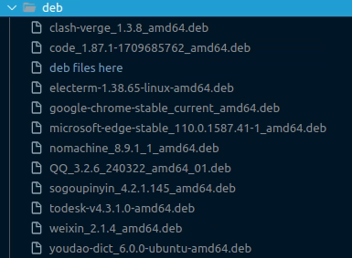

# Ubuntu 重装后运行脚本

由于最近经常需要重装Ubuntu系统，所以写了一个脚本来自动化安装一些常用的软件。

## 支持系统版本

Ubuntu amd64 桌面版
20.04 LTS，22.04 LTS

## 文件说明
1. `./deb/`目录：通过软件包(.dab)安装的软件，将软件包添加到该目录下
2. `./sh/install_apt.sh`：安装通过apt安装的软件
3. `./sh/install_dab.sh`：安装在`./deb/`目录下的软件包
4. `./sh/sogou.sh`：卸载ibus并安装搜狗输入法（推荐，需要在“语言支持”中设置键盘输入法系统为fcitx）
5. `./sh/docker.sh`：安装docker官方推荐指令（推荐）
6. `./sh/fishros_ros_docker.sh`：安装fishros的ROS1的docker容器（Ubuntu 20.04版本镜像）。选择容器的原因是ROS的安装和配置比较麻烦，并且ROS会跟Anaconda冲突，使用容器可以避免这些问题。
7. `./sh/boot-repair.sh`：安装boot-repair（推荐）,这个软件对于双系统（windows+ubuntu）的用户来说非常有用，可以修复grub引导。使用方法自行百度。
8. `./sh/tsinghua_source.sh`：更换清华源（不推荐），Ubuntu 20.04以上已经支持在“软件和更新”中更换源，不需要使用脚本。

其他文件：其他文件为一些软件的安装脚本，可以根据需要选择是否运行。

## 运行

```shell
. init.sh
```

## deb建议安装的软件包

